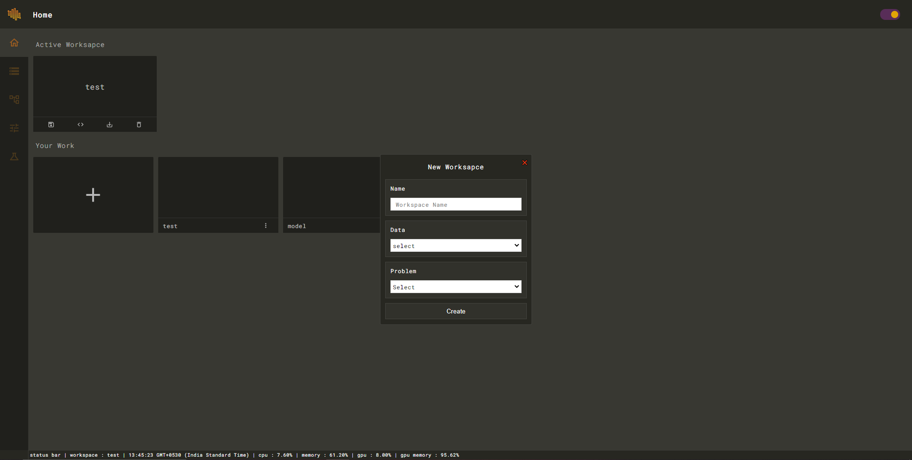
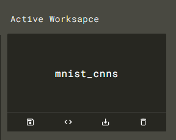

# Basic Usage

## Running Studio

```
$ neural-studio help

Neural Studio 0.0.2

Options:
  -host : set host
  -port : set port
  -dir  : set project directory

  --no-cached-dataset : won't load dataset from active workspace
  --no-cached-model   : won't load last saved model from active workspace
  --no-browser        : won't open browser

  help    : display help
  version : display version

Usage:
  neural_studio [options]
```


```text
# run neural studio 

$ neural-studio
╔═════════════════════════════════╗
║ Running                      ║
║ Host : localhost             ║
║ Port : 8000                  ║
║ URL  : http://localhost:8000 ║
╚═════════════════════════════════╝
```

## 1. Creating a workspace


Click on the ➕ card to initialize workspace wizard.



Fill up the form according to your project.


After creating the workspace you'll see something like this.



