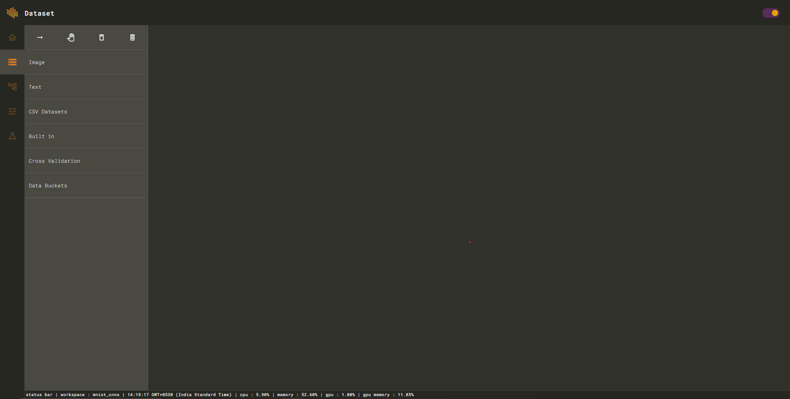
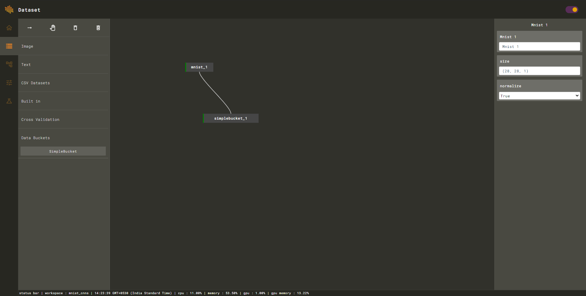
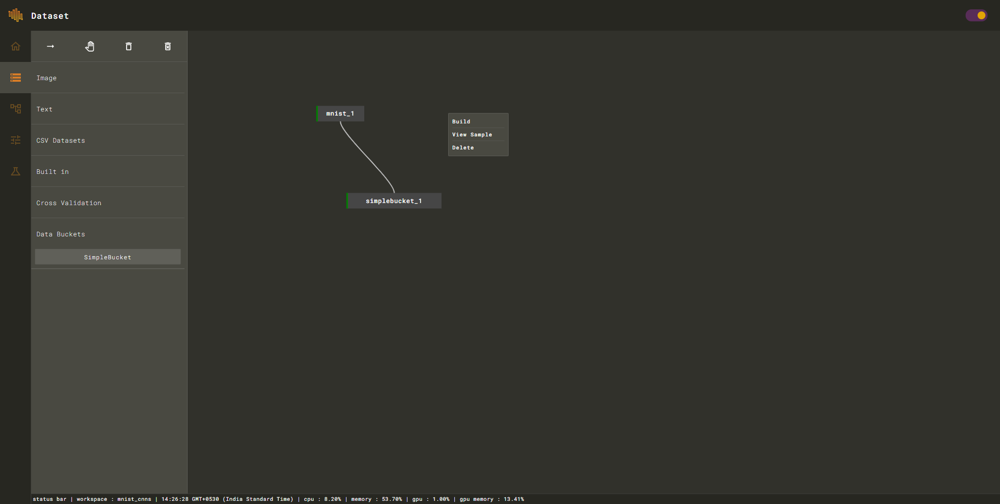
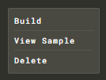
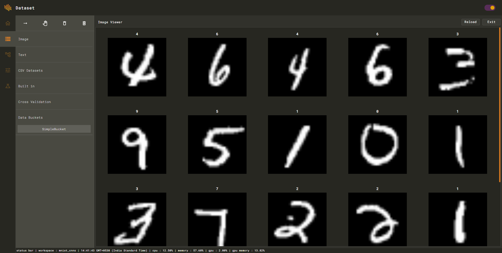

# Add Dataset

Open dataset builder to create a new dataset.

Build dataset using pre defined nodes according to your needs.


MNIST is one of the inbuilt datasets that are ready to use without any pre-processing. 


After creating the dataset graph compile it using build option in context menu.

After building the dataset you can view a sample using \`View Sample\` option.

After building the dataset go to graph editor to model your neural network. 

