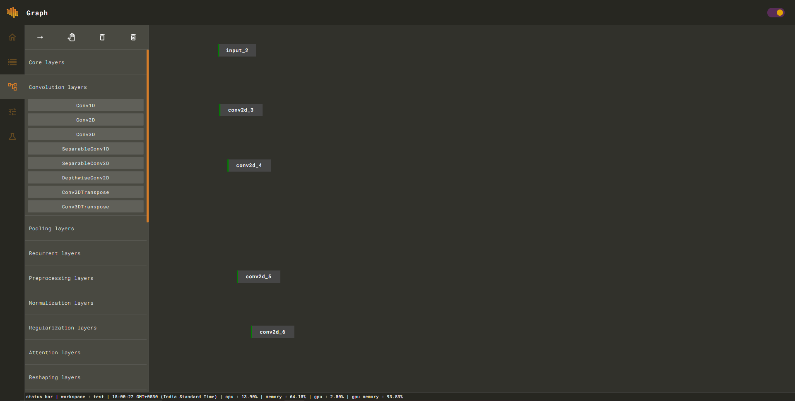
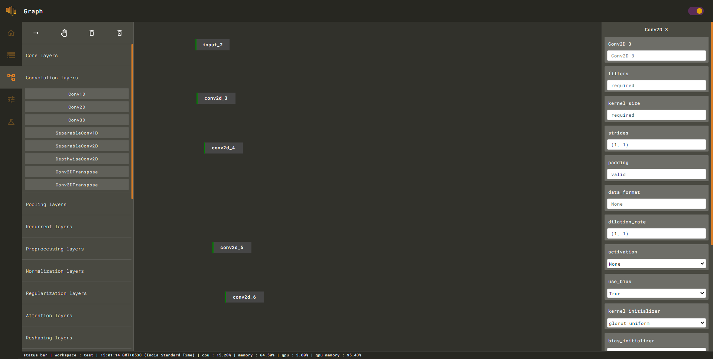
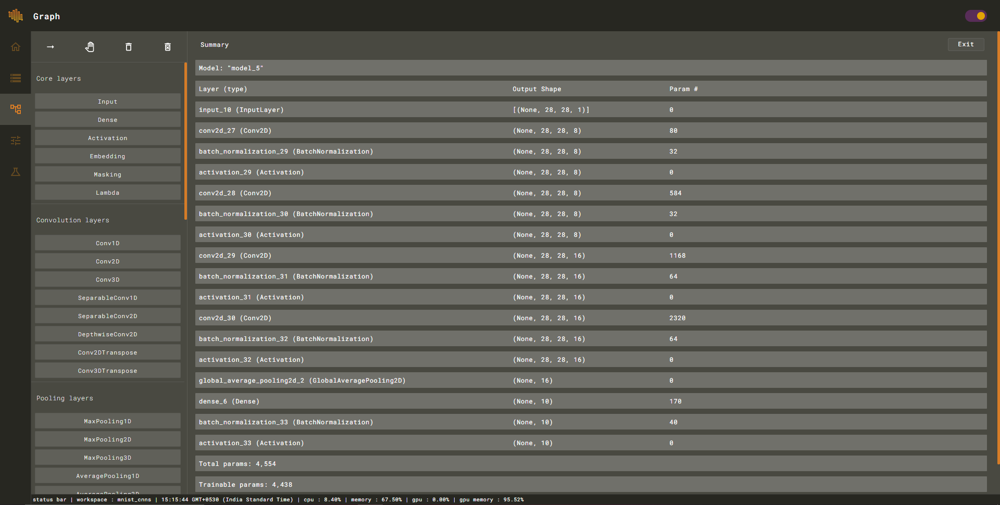

# Add Model

Add required nodes from inbuilt layers API.

Edit layer parameter by clicking on layer node which will open layer editor.

You can add, move, connect and remove layer nodes using tools provided in the upper left toolbar.

After you are done with the modeling, you can view model summary from the context menu.

After you are satisfied with your model architecture you can move on to training utility.

