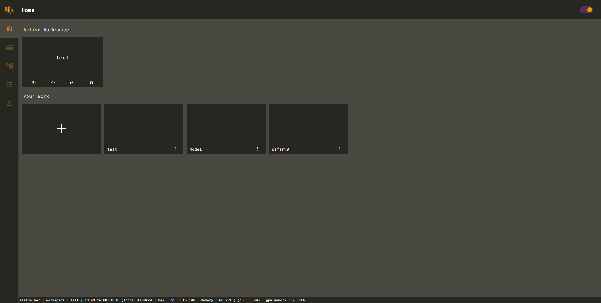
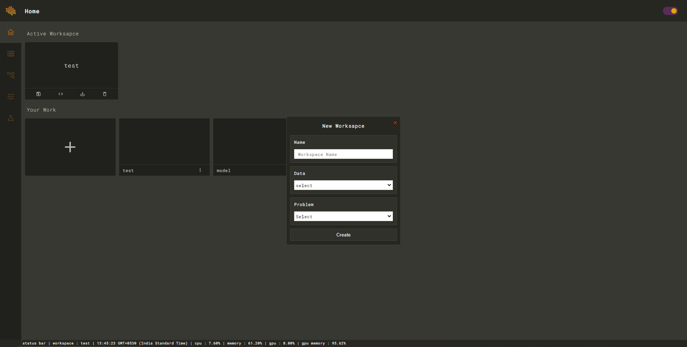
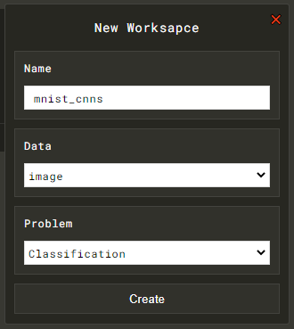
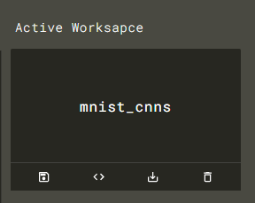

# Creating A Workspace

Click on the ➕ icon on the home page to get started with workspace wizard.

It will open a workspace initialization wizard.

Fill the wizard with relevent details.

Clicking on create will initialize a new workspace as following.

