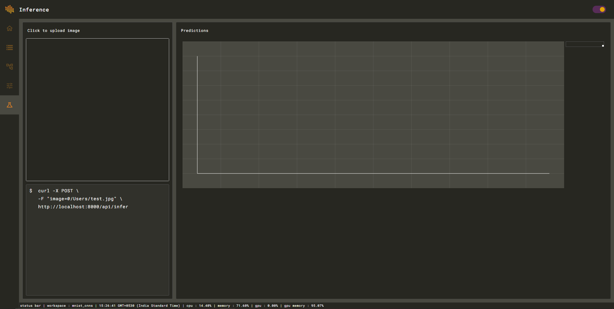
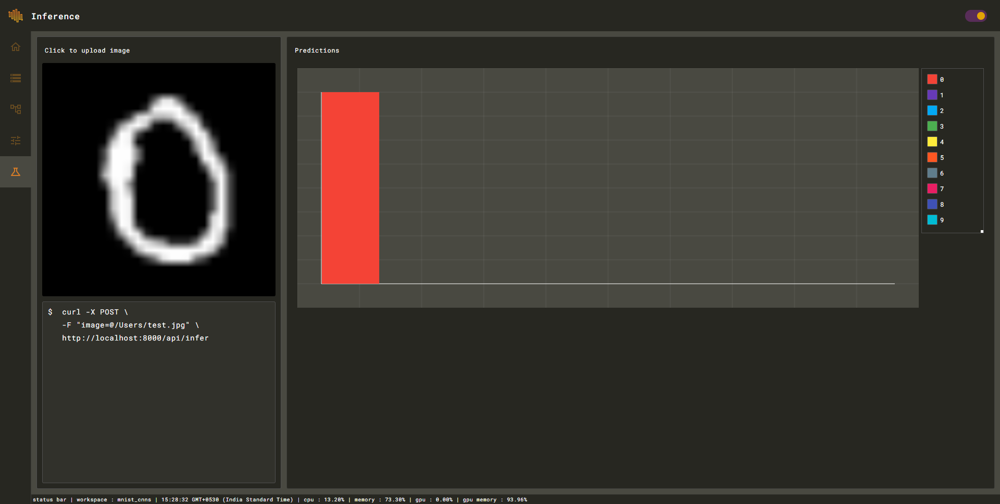

# Inference

Inference engine provides an easy to use UI to use your trained model on new data.



When you upload the image the engine will automatically predict and visualize the output.



You can also access the inference API using the deployment toolkit. For example, with this example you can perform inference using tools such as CURL.

```text
$  curl -X POST \
   -F "image=@/Users/test.jpg" \
   http://localhost:8000/api/infer
```

