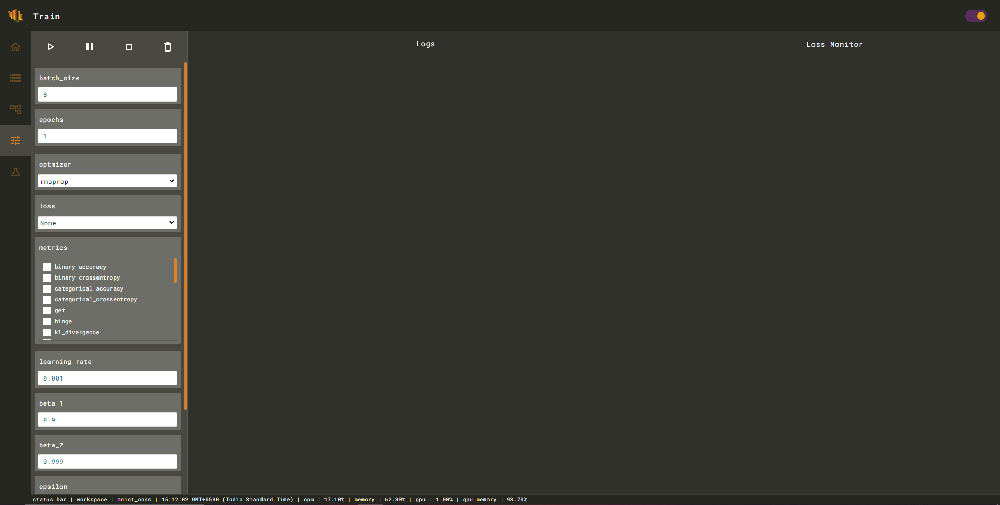
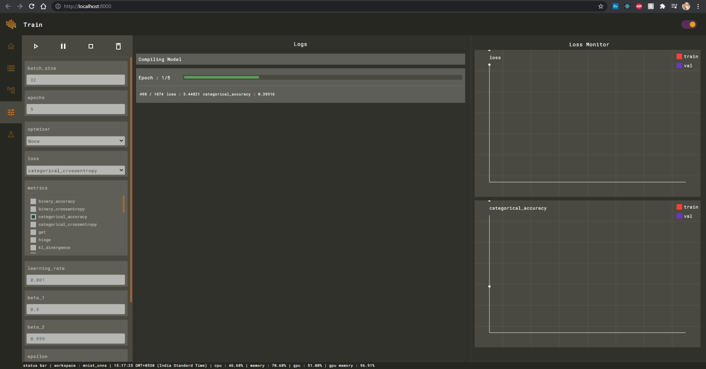

# Train

Training interface provides various options to train and tune your model with live loss monitoring without using any extentions.

Edit training parameters and start the training.

After the training is done and you're satisfied with the performance, you can start using inference engine to use your model on newer data.

